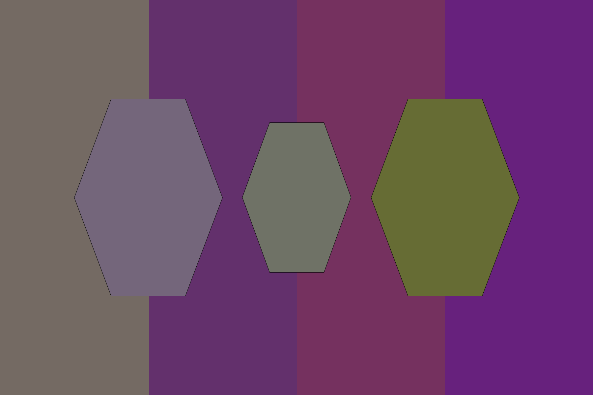

# Hexillology - 25 points
## Description

I recently designed a new [flag](https://static.tjctf.org/af83861c918131864a4e3df24c49d9bad766ae701f02387ee0698593b44f3390_Hexillology.png) for my imaginary nation, Hexistan. Do you like it?



## Penyelesaian

Dari soal terdapat hint **hex**. Hex dapat berupa kode warna. Menggunakan [color picker](https://imagecolorpicker.com/en/) untuk mendapatkan kode hex dari gambar tersebut.

Kode hexadecimal yang didapat adalah `746a63 74667b 63306c 6f7266 75315f 666c34 67217d`. Menggunakan [aplikasi online](https://www.rapidtables.com/convert/number/hex-to-ascii.html), dapat dikonversi menjadi text yang menunjukkan flagnya.

## Flag

```
tjctf{c0lorfu1_fl4g!}
```